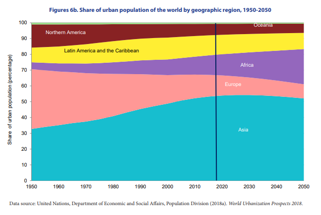

```{r setup, include=FALSE}
knitr::opts_chunk$set(warning = FALSE, message = FALSE)
```

### {.tabset} 

#### Original

<br>
<center>

</center>
<center>*Source:United Nations, Department of Economic and Social Affairs, Population Division (2018a). World Urbanization Prospects 2018.*</center>
<br>

**Objective**


The objective of the original data visualisation was to show the trend in share of urban population of the world from the 1950’s and it’s projected shares up until the year 2050.

The original visualisation was published in the United Nations World Urbanization Prospects 2018 Highlights publication, by the Department of Economic and Social Affairs’ Population Division. This indicates that the report, and by extension the visualisation, was intended for the general public. Although, the publication is not among those that is read by everyone, it is informative and should be easily understandable to anyone who does.

The visualisation chosen had the following three main issues:

* Chart Type: For the visualisation, the author chose to make use of a stacked area chart to indicate the percentage distribution of urban population by geographic regions. Since the intended audience of the source publication and the visuaisation was the general public, the choice of visualisation would increase the effort required by the audience to understand what the author intends to relay.

* The original visualisation had a poor choice of color combination used by the author, which could induce some strain to the viewers eyes. This visualisation was also not safe from some common forms of color blindness, such as Anomalous Trichomacy and Dichromacy. Audiences affected by sensitivities or lacking in abilities to perceive Red, Green or Blue would be confused by the color palette used.

* The original visualisation also lacked some general labelling. It lacked the labelling of x-axis, which would indicate what the it signified. The classifications in the data were poorly presented in the visualisation, as Oceania seemed to be labelled in the same region as North America, which could confuse most of the audience. The visualisation also indicated a verticle line with no annotation. This could confuse the viewer between a mean value, while the author intended to show data for the current year.

**Reference**

* United Nations, Department of Economic and Social Affairs, Population Division (2019). World Urbanization
Prospects 2018: Highlights (ST/ESA/SER.A/421) website: https://population.un.org/wup/Publications/Files/WUP2018-Highlights.pdf

#### Code

The following code was used to fix the issues identified in the original. 

```{r}
library(ggplot2)
library(magrittr)
library(tidyr)
library(dplyr)
library(readxl)
library(viridis)
library(plotly)

Dataset_percent <- read_xlsx("Dataset_percent.xlsx")
Dataset_percent$year <- as.numeric(Dataset_percent$year)

plot <- ggplot(data = Dataset_percent,
                aes(x = year,
                    y = percent,
                    group = Region,
                    color = Region)) + theme_bw() + labs(title = "Share of Urban Population of the World by Geographic Region, 1950 - 2050",
                                                                                         x = "Year",
                                                                                         y = "Share of Urban Population (Percentage)")

plotwithgeom <- plot + geom_line(size = 1) + geom_point() + scale_color_manual(values=cividis(6)) + scale_x_continuous(expand = c(0,0), breaks = seq(from = 1950, to = 2050, by = 10), limits = c(1950, 2050)) + scale_y_continuous(expand = c(0,0), limits = c(0,100))

r<-ggplotly(plotwithgeom, tooltip = c("year","percent")) %>% layout(xaxis = list(showspikes = T), yaxis = list(showspikes = T), hovermode = "x", legend = list(x = 0, y = 1), margin = list(r = 15))
```

**Data Reference**

* Population.un.org. (2019). UNITED NATIONS DESA / POPULATION DIVISION. [online] Available at: https://population.un.org/wup/Download/Files/WUP2018-F03-Urban_Population.xls [Accessed 21 Sep. 2019]


#### Reconstruction

The following plot fixes the main issues in the original.

```{r fig.align="center", echo = FALSE}
r
```

